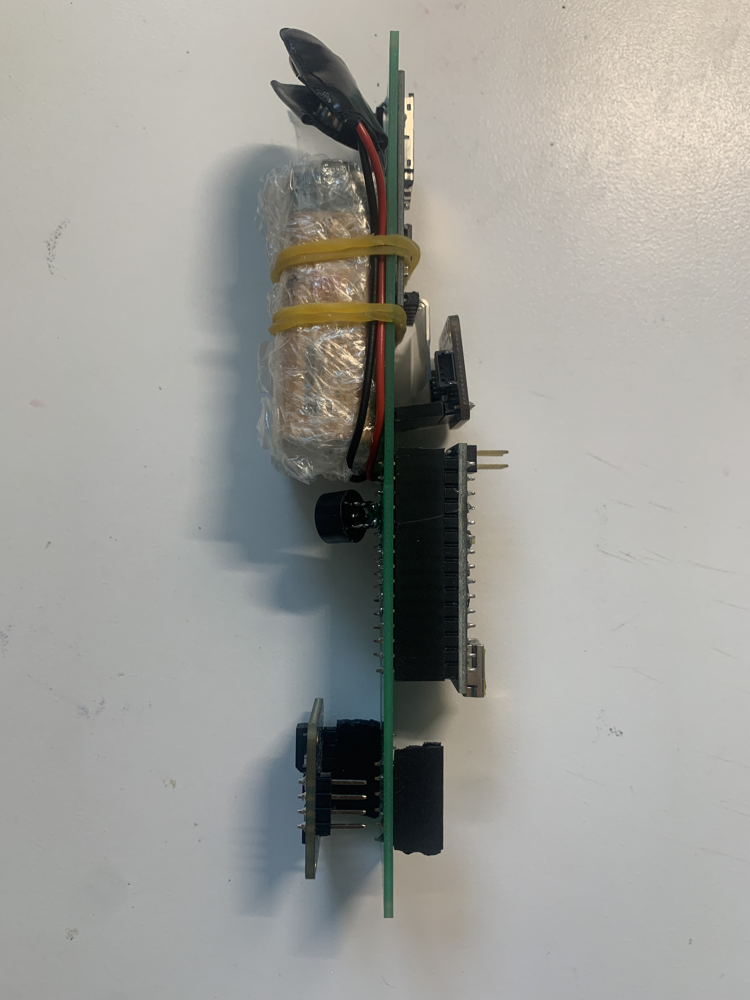

# RPL Daedalus Avionics

5.11.24
Welcome! This is my guide for the RPL Daedalus Project Avionics, in particular, the software and PCB files I designed and used on my rocket during the 2022-2023 cohort.
I used an Arduino Nano to drive 2 sensors, a pressure/altitude/temperature sensor (BMP388), and an IMU/gyroscope/accelerometer/magnetometer (BNO055). The system also includes an SD Card and Module, and a battery. The code written is designed to read pressure/temp/altitude, IMU data, and write it to the SD Card.

The PCB Files are attached, I designed in Eagle. Feel free to copy and edit these files to add or remove any functionalities.

See my latest version and updates below.

## v2/IMUFlightComp.ino
5.20.23 

This is the newest flight computer software that interfaces with the PCB v2.0. It has support for BMP388 temperature, pressure, and altitude sensing, as well as IMU 9DoF Raw Data: Accelerometer, Gyroscope, and Magnetometer data. The software reads all the above data, including IMU calibration status data, and writes them to the SD card in CSV format.

CSV format:
*Temperature (C), Pressure (hPa), Altitude (m), IMU Calibration (System), IMU Calibration (Accelerometer), IMU Calibration (Gyroscope), IMU Calibration (Magnetometer), Accel_X (m/s^2), Accel_Y (m/s^2), Accel_Z (m/s^2), Gyro_X (rad/s), Gyro_Y (rad/s), Gyro_Z(rad/s), Mag_X (uT), Mag_Y (uT), Mag_Z (uT)*

This version of code also supports a Piezo buzzer (but the PCB does not have a spot for the buzzer, this code can only be used on a system designed with a buzzer.) This version plays a constant buzz to inform that data is successfully reading and writing to SD. If not buzzing, the SD Card is likely not initialized properly. Eject and re-enter, and click RESET on the Arduino. Continue until the buzz begins.

## Hardware Setup
5.21.23

## PCB v2.0
5.6.23

3D Views:

Board: 

Schematic: 

## v1.0

This is the flight computer for our NMP Avionics system. 

*The software is designed for BMP388 only. Software is not necessarily compatible for BMP280. Hardware IS compatible with both, but you must write your own code to call the BMP280 library instead of the BMP388.*

`flightComputer.ino` is the flight program. Once uploaded, there will be a 5s delay, then the BMP388 sensor will read in temp, pressure, and altitude data, and write to a file in the SD card once every 100ms.

`flightCompDebug.ino` is outdated. It was a duplicate sandbox code to practice and debug. 

### Hardware/PCB v1 Setup:

Ensure the BMP388 and BMP280 are wired/soldered to the PCB correctly. 
On the PCB, GND is the 2nd pin from the right. Match the GND pin of your component (BMP280) and the GND pin on the PCB when orienting your components to ensure functionality.

## Procedure (BMP388 only):
1. Solder PCB components: Arduino Nano, BMP388, SD Card Module, and battery. Ensure you have a new battery. Keep battery OFF. Mount an SD Card.
2. Download flightComputer.ino to your Arduino IDE.
3. Edit flightComputer.ino to Arduino Nano. For testing, ensure number in the filename in line 164 is 100+. If flying, change number to 1-99. This helps for post-processing to distinguish the correct data.
4. Upload your version of flightComputer.ino to the Nano thru USB cable. Check serial monitor to ensure valid output stream. Unplug the cable, now you have successfully uploaded the program and will supply power from now on through the battery pack.
5. Mount the avionics bay in your rocket. When flight time comes, turn on the battery pack. Remember, after 5s, the program will begin. It will end when it loses power or runs out of memory. (Battery goes out much quicker (~10h) than filling up 32GB of storage with plain text, see notes.)
6. Recover the rocket and turn OFF the switch. Read from SD Card for data analysis.

# Notes:
## Memory
How long will it take to fill a 32gb SD card with this data (25 bytes per line)?
- In CSV file, 25 chars = 25 bytes per line
	- 25 bytes / 0.1 second
	- 250 bytes / 1 second
	- 15,000 bytes / 1 min
	- 900,000 bytes / 1 hour
	- 21,600,000 / 24hrs or 1 day
- 32GB = 32,000,000,000 bytes
- It will take 35,555 hours or 1481 days to fill the SD Card at a rate of 25 bytes / sec and 32GB storage
